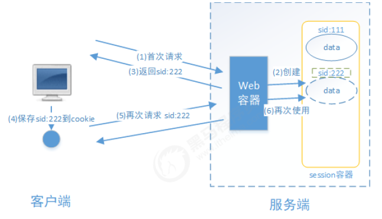
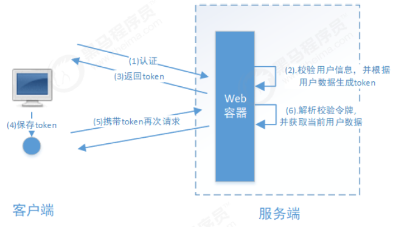

# 1 基本概念

## 1.1 什么是认证

​		用户认证就是判断一个用户的身份是否合法的过程，用户去访问系统资源时系统要求验证用户的身份信息，身份合法方可继续访问，不合法则拒绝访问。常见的用户身份认证方式有：用户名密码登录，二维码登录，手机短信登录，指纹认证等方式。

## 1.2 什么是会话

​		用户认证通过后，为了避免用户的每次操作都进行认证可将用户的信息保证在会话中。会话就是系统为了保持当前用户的登录状态所提供的机制，常见的有基于session方式、基于token方式等。
​		*基于session的认证方式如下图：*

​		它的交互流程是，用户认证成功后，在服务端生成用户相关的数据保存在session(当前会话)中，发给客户端的sesssion_id 存放到 cookie 中，这样用户客户端请求时带上 session_id 就可以验证服务器端是否存在 session 数据，以此完成用户的合法校验，当用户退出系统或session过期销毁时,客户端的session_id也就无效了。

​		*基于token的认证方式如下图：*

​		它的交互流程是，用户认证成功后，服务端生成一个token发给客户端，客户端可以放到 cookie 或 localStorage等存储中，每次请求时带上 token，服务端收到token通过验证后即可确认用户身份。

## 1.3 什么是授权

​		授权是用户认证通过根据用户的权限来控制用户访问资源的过程，拥有资源的访问权限则正常访问，没有权限则拒绝访问。

​		认证是为了保证用户身份的合法性，授权则是为了更细粒度的对隐私数据进行划分，授权是在认证通过后发生的，控制不同的用户能够访问不同的资源。

**基于角色的访问控制（Role-Based Access Control）**是按角色进行授权，比如：主体的角色为总经理可以查询企业运营报表，查询员工工资信息等

**基于资源的访问控制（Resource-Based Access Control）**是按资源（或权限）进行授权，比如：用户必须具有查询工资权限才可以查询员工工资信息等