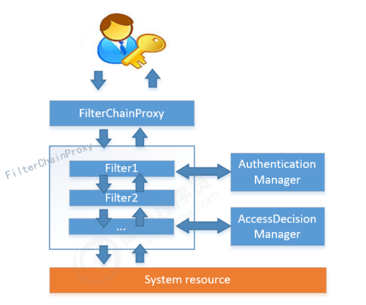
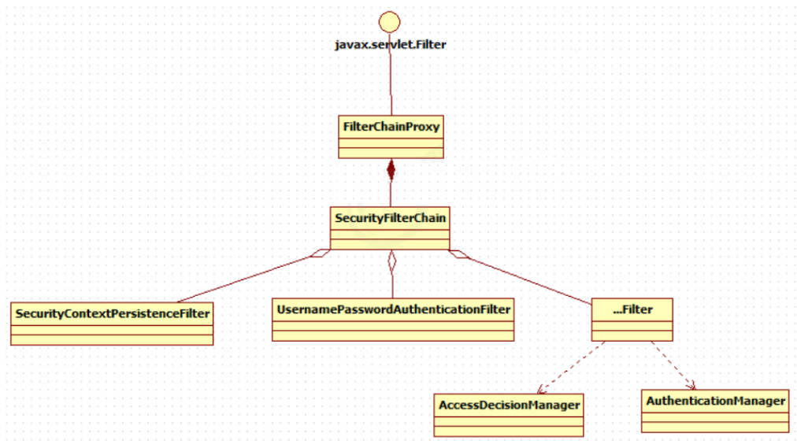
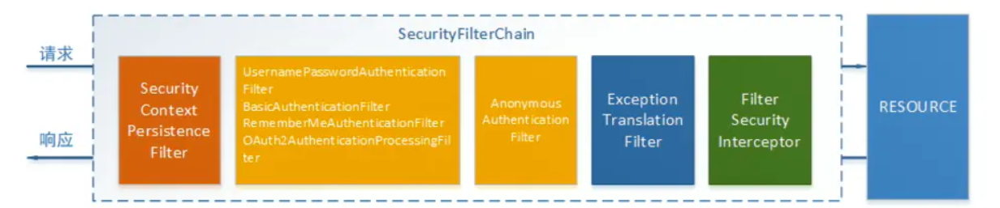

# Spring Security介绍

Spring Security是一个能够为基于Spring的企业应用系统提供声明式的安全访问控制解决方案的安全框架。

由于它是Spring生态系统中的一员，因此它伴随着整个Spring生态系统不断修正、升级，在spring boot项目中加入springsecurity更是十分简单，使用Spring Security 减少了为企业系统安全控制编写大量重复代码的工作。

**认证页面**
springSecurity提供了默认认证页面（  http://localhost:8080/login  http://localhost:8080/logout ）

**安全配置**
spring security提供了基于账号和密码的认证方式，通过安全配置即可实现请求拦截，授权、会话管理等认证功能，只需要配置即可使用

# 结构总览

Spring Security所解决的问题就是**安全访问控制**，而安全访问控制功能其实就是对所有进入系统的请求进行拦截，校验每个请求是否能够访问它所期望的资源。根据前边知识的学习，可以通过Filter或AOP等技术来实现，SpringSecurity对Web资源的保护是靠Filter实现的，所以从这个Filter来入手，逐步深入Spring Security原理。
当初始化Spring Security时，会创建一个名为`SpringSecurityFilterChain`的Servlet过滤器，类型为org.springframework.security.web.FilterChainProxy，它实现了javax.servlet.Filter，因此外部的请求会经过此类，下图是Spring Security过虑器链结构图：

FilterChainProxy是一个代理，真正起作用的是FilterChainProxy中SecurityFilterChain所包含的各个Filter，同时这些Filter作为Bean被Spring管理，它们是Spring Security核心，各有各的职责，但他们并不直接处理用户的认证，也不直接处理用户的授权，而是把它们交给了认证管理器（AuthenticationManager）和决策管理器（AccessDecisionManager）进行处理，下图是FilterChainProxy相关类的UML图示：

Spring Security功能实现主要是由一些列过滤器相互配合完成。

**下面介绍过滤器中主要的几个过滤器及其作用：**
`SecurityContextPresistenceFilter`这个Filter是整个拦截过程的入口和出口（也就是第一个和最后一个拦截器），会在请求开始时从配置好的SecurityContextRepository中获取SecurityContext，然后把它设置给SecurityContextHolder。在请求完成后将SecurityContextHolder持有的SecurityContext再保存到配置好的SecurityContextRepository，同时清除SecurityContextHolder所持有的SecurityContext;
`UsernamePasswordAuthenticationFilter`用于处理来自表单提交的认证。该表单必须提供对应的用户名和密码，其内部还有登录成功或失败后进行处理的AuthenticationSuccessHandler和AuthenticationFailureHandler，这些都可以根据需求做相关改变;
`FilterSecurityInterceptor`是用于保护web资源的，使用AccessDecisionManager对当前用户进行授权访问，前面已经详细介绍过了;
`ExceptionTranslationFilter`能够捕获来自FilterChain所有的异常，并进行处理。但是它只会处理两类异常：AuthenticationException和AccessDeniedException，其他的异常它会继续抛出。

